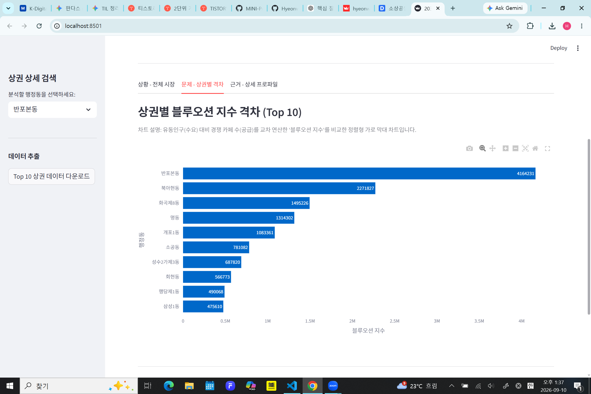

# 서울시 2030 타겟 카페 상권 분석 파이프라인 및 대시보드

## 1. 개요 
본 프로젝트는 서울시 열린데이터광장의 '생활인구' 데이터와 '상권 상가업소' 데이터를 수집하여, 2030 세대를 타겟으로 하는 카페 창업 최적 입지를 도출하는 데이터 파이프라인 및 대시보드입니다.
* **핵심 목표:** 거주인구가 아닌 '실제 유동인구'와 '경쟁 카페 수'를 교차 분석하여 생존 확률이 높은 블루오션 상권 발굴
* **주요 기술:** Python, MariaDB, Streamlit, Pandas
* **아키텍처:** 데이터 수집기(Collector) - 데이터베이스(DB: Raw/Mart 분리) - 대시보드(App)의 3계층 단방향 구조 적용

---

## 2. 대시보드 스크린샷 
**1. 핵심 KPI 및 최종 추천 상권 요약**
> 상단에 데이터 필터링을 거친 1~3위 추천 상권 타이틀과 이상치 제외 안내 문구가 표시되며, 주요 4대 지표(블루오션 지수, 유동인구, 활동 배율, 잠재고객)를 요약합니다.


**2. [Tab 1] 전체 시장 데이터 (팩트 체크)**
> 서울시 전체 상권의 거주 인구와 유동 인구 불균형을 보여주는 표입니다. (통계적 이상치가 포함된 원본 데이터의 투명한 공개)


**3. [Tab 2] 상권별 블루오션 지수 격차 (Top 10)**
> 유동인구(수요) 대비 경쟁 카페 수(공급)를 교차 연산한 '블루오션 지수'를 정렬형 가로 막대 차트로 직관적으로 비교합니다.


**4. [Tab 3] 타겟 상권 24시간 유동인구 추이**
> 사이드바에서 선택한 특정 상권의 24시간 흐름을 선 그래프로 나타내어, 매장 피크 타임 및 인력 배치 전략 수립의 근거를 제공합니다.


---

## 3. 실행 순서
본 프로젝트는 수집과 조회가 분리되어 있습니다. 아래 순서대로 명령어를 입력하여 파이프라인을 가동할 수 있습니다.

## Step 0. 환경 설정
`project/` 최상위 경로에 `.env` 파일을 생성하고 아래 정보를 입력합니다.

```text
DB_HOST=127.0.0.1
DB_PORT=3306
DB_USER=root
DB_PASSWORD=본인비밀번호
DB_NAME=project_db
```

## Step 1. DB 스키마 생성 및 기초 데이터 적재
**기초 CSV 데이터 다운로드**
> 미니프로젝트1에서 했던 데이터 파일을 그대로 가져와 사용하였습니다.
> 원본 CSV 데이터는 `.gitignore`로 제외되었습니다.
> 코드를 실행하기 전, CSV 파일을 다운로드하여 `project/data/` 폴더에 넣어주세요.
- 소상공인시장진흥공단_상가(상권)정보:
  제공기관: 소상공인시장진흥공단
  URL: https://www.data.go.kr/data/15083033/fileData.do
  기준 시점: 20260630
- 행정안전부_지역별(행정동) 성별 연령별 주민등록 인구수:
  제공기관: 행정안전부
  URL: https://www.data.go.kr/data/15097972/fileData.do
  기준 시점: 20260630

MariaDB에 접속하여 프로젝트용 데이터베이스를 생성한 후, 터미널에서 아래 명령어를 순서대로 실행합니다.
# 1. 스키마 생성 및 인덱스 설정
```env
mysql -u root -p project_db < db/schema.sql
```

# 2. 기초 CSV 데이터(거주인구, 카페정보) 및 매핑 테이블 적재
```bash
python miniproject2/collector/load_csv_to_db.py
python miniproject2/collector/load_mapping.py
```

## Step 2. API 데이터 수집 (Collector 계층)
서울시 OpenAPI를 호출하여 24시간 생활인구 데이터를 DB 원본(Raw) 테이블에 적재합니다.
```bash
python -m collector
```

## Step 3. 데이터 마트(Mart) 집계
무거운 연산을 대시보드에서 제외하기 위해, DB 단에서 KPI를 사전 연산하여 마트 테이블을 생성합니다.
```bash
mysql -u root -p project_db < db/build_mart.sql
```

## Step 4. 대시보드 실행
모든 데이터 준비가 완료되면 대시보드를 구동합니다
```bash
streamlit run app/main.py
```
